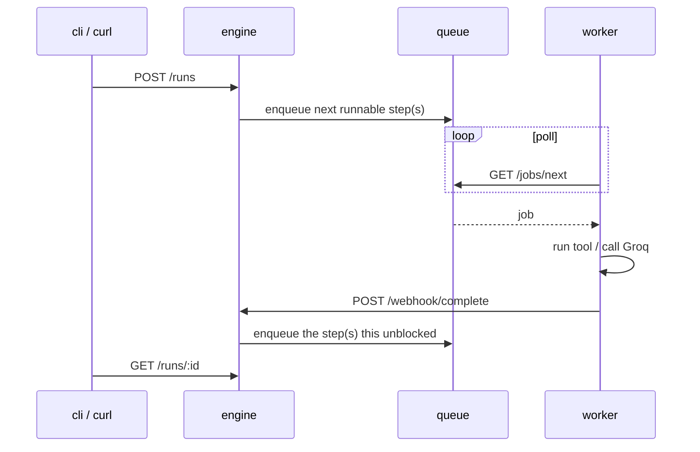

# Axon

A distributed AI agent orchestration framework with a built-from-scratch task queue.

Agents are defined as JSON, not code: a DAG of steps (tool calls, LLM calls,
conditionals, sub-agent calls, and LLM-supervised loops) that the engine drives to
completion by enqueuing work and reacting to results as they come back.

## Architecture

Four parts:

- **queue**: a Redis-backed job queue: enqueue, dequeue, ack/nack, retries with a
  cap, then permanent failure.
- **engine**: the orchestrator. Loads agent definitions, walks the DAG, enqueues
  the next runnable step(s), and advances the run when the queue tells it a step
  finished (or failed for good).
- **worker**: polls the queue, dispatches each job to a tool, an LLM, or a
  supervisor decision, then reports the result back to the engine.
- **cli**: a thin HTTP client for the engine's API (`axon run`, `axon status`).



The engine never runs a step itself as it only decides what's runnable next. The
worker never knows about the DAG, it just executes one job at a time and reports
back.

## Step types

An agent's `steps` array can mix five kinds of step:

| Type | What it does |
|---|---|
| `tool_call` | Runs a registered tool (`echo`, `tavily_search`) against `input_template`. |
| `llm_call` | Sends `prompt_template` to Groq, records the completion as output. |
| `conditional` | Evaluates `condition` (`==`, `!=`, or `contains`) against prior step output, resolved inline (no worker round trip), branches to `on_true`/`on_false`. |
| `agent_call` | Spawns another agent as a child run, waits for its `output_step`'s result. |
| `supervisor` | Sends `prompt_template` to Groq, which picks one of `options` to run next; loops until the model answers `done` or the iteration cap is hit. |

Every field can reference earlier results via `{{step_id.output}}`, the original
input via `{{user_input}}`, or (for a supervisor) its own loop count via
`{{step_id.iteration}}`. See `engine/agents/` for real, working examples of each,
from a two-step tool chain up through a supervised research loop.

A minimal agent (`engine/agents/greeter.json`):

```json
{
  "name": "greeter",
  "output_step": "greet",
  "steps": [
    {
      "id": "greet",
      "type": "tool_call",
      "tool": "echo",
      "input_template": "Hello, {{user_input}}!",
      "depends_on": []
    }
  ]
}
```

Every agent JSON file dropped into `engine/agents/` is loaded and validated at
engine startup; a malformed one (dangling step reference, missing required field,
unknown step type) is rejected with every problem it found, not just the first.

## Running locally

The easiest way to run all four parts together is docker-compose.

```sh
docker compose up --build
```

This starts Redis, the queue, the engine, and a worker, wired together. The engine
is reachable at `http://localhost:8000`, the queue at `http://localhost:8080`.

Tool calls that need a real API key (`tavily_search`, and any `llm_call`/`supervisor`
step, which use Groq) need `TAVILY_API_KEY`/`GROQ_API_KEY` set for the worker. Copy
`.env.example` to `.env` and fill in real values before starting the stack; without
it the worker still runs, it just warns and rejects jobs that need a key it doesn't
have.

Once it's up, create a run against a built-in agent (see `engine/agents/`):

```sh
curl -s -X POST http://localhost:8000/runs \
  -H "Content-Type: application/json" \
  -d '{"agent_name":"greeter","input":"world"}'
```

or use the CLI:

```sh
cd cli
go run ./cmd run greeter "world"
go run ./cmd status <run_id>
```

### Running without Docker

Each service is a normal Go binary if you'd rather run them directly (useful for
iterating on one service without rebuilding an image):

```sh
redis-server --port 6379
cd queue  && go run ./cmd/main.go -mode api -port 8080
cd engine && go run ./cmd --agents agents --port 8000 --queue http://localhost:8080 --redis redis://localhost:6379
cd worker && go run ./cmd --queue http://localhost:8080 --engine http://localhost:8000
```

## Tests

Each module has its own tests, run from that module's directory:

```sh
go test ./...
```
